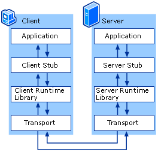
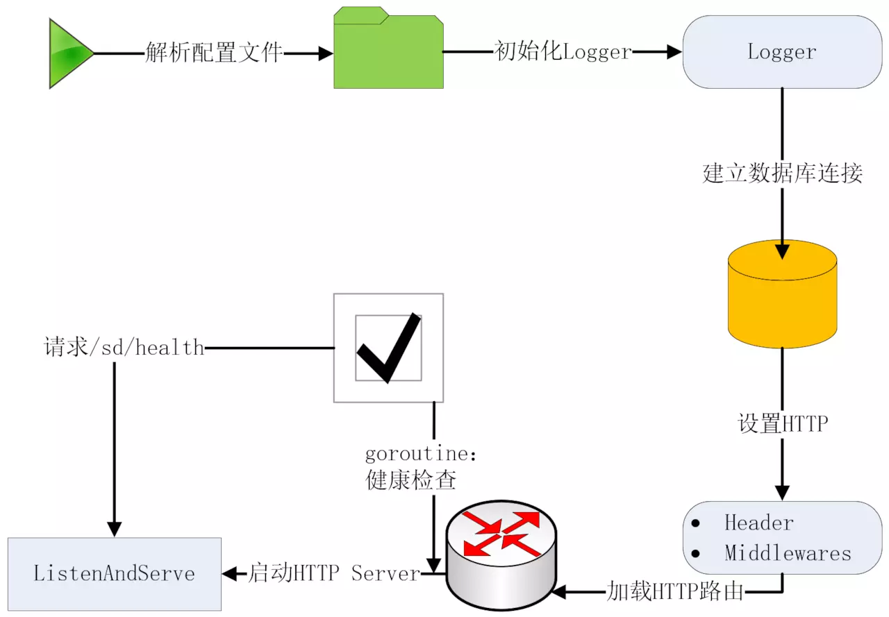

# apiserver
Go 语言 API 开发中常用的组合是`gRPC + Protobuf`和`REST + JSON`。

## 什么是 REST
REST（REpresentational State Transfer）代表表现层状态转移。REST 是一种软件架构风格，不是技术框架，REST 有一系列规范，满足这些规范的 API 均可称为 RESTful API。
REST 规范中有如下几个核心：

1. REST 中一切实体都被抽象成资源，每个资源有一个唯一的标识 —— URI，所有的行为都应该是在资源上的 CRUD 操作
2. 使用标准的方法来更改资源的状态，常见的操作有：资源的增删改查操作
3. 无状态：这里的无状态是指每个 RESTful API 请求都包含了所有足够完成本次操作的信息，服务器端无须保持 Session

在 HTTP 协议中通过 POST、DELETE、PUT、GET 方法来对应 REST 资源的增、删、改、查操作:

| HTTP 方法	| 行为 | URI | 示例说明 |
| ------ | ------ | ------ | ------ |
| GET | 获取资源列表	 | `/users` | 获取用户列表 |
| GET | 获取一个具体的资源 | `/users/admin` | 获取 admin 用户的详细信息 |
| POST | 创建一个新的资源 | `/users` | 创建一个新用户 |
| PUT | 以整体的方式更新一个资源	 | `/users/1` | 更新 id 为 1 的用户 |
| DELETE | 删除服务器上的一个资源 | `/users/1` | 删除 id 为 1 的用户 |


## 什么是 RPC
RPC（Remote Procedure Call，RPC）远程过程调用。是一个计算机通信协议。该协议允许运行于一台计算机的程序调用另一台计算机的子程序，而程序员无须额外地为这个交互作用编程。
通俗来讲，就是服务端实现了一个函数，客户端使用 RPC 框架提供的接口，调用这个函数的实现，并获取返回值。RPC 屏蔽了底层的网络通信细节，使得开发人员无须关注网络编程的细节，
而将更多的时间和精力放在业务逻辑本身的实现上，从而提高开发效率。

RPC 的调用过程如下（图片来自 [How RPC Works](https://docs.microsoft.com/en-us/previous-versions/windows/it-pro/windows-server-2003/cc738291(v=ws.10))）：



1. Client 通过本地调用，调用 Client Stub
2. Client Stub 将参数打包（也叫 Marshalling）成一个消息，然后发送这个消息
3. Client 所在的 OS 将消息发送给 Server
4. Server 端接收到消息后，将消息传递给 Server Stub
5. Server Stub 将消息解包（也叫 Unmarshalling）得到参数
6. Server Stub 调用服务端的子程序（函数），处理完后，将最终结果按照相反的步骤返回给 Client

> Stub 负责调用参数和返回值的流化（serialization）、参数的打包解包，以及负责网络层的通信。Client 端一般叫 Stub，Server 端一般叫 Skeleton。

## REST vs RPC
RPC 相比 REST 的优点主要有 3 点：
1. RPC+Protobuf 采用的是 TCP 做传输协议，REST 直接使用 HTTP 做应用层协议，这种区别导致 REST 在调用性能上会比 RPC+Protobuf 低
2. RPC 不像 REST 那样，每一个操作都要抽象成对资源的增删改查，在实际开发中，有很多操作很难抽象成资源，比如登录操作。所以在实际开发中并不能严格按照 REST 规范来写 API，
RPC 就不存在这个问题
3. RPC 屏蔽网络细节、易用，和本地调用类似

REST 相较 RPC 的优势：
1. 轻量级，简单易用，维护性和扩展性都比较好
2. REST 相对更规范，更标准，更通用，无论哪种语言都支持 HTTP 协议，可以对接外部很多系统，只要满足 HTTP 调用即可，更适合对外，RPC 会有语言限制，不同语言的 RPC 调
用起来很麻烦
3. JSON 格式可读性更强，开发调试都很方便
4. 在开发过程中，如果严格按照 REST 规范来写 API，API 看起来更清晰，更容易被大家理解

业界普遍采用的做法是，内部系统之间调用用 RPC，对外用 REST，因为内部系统之间可能调用很频繁，需要 RPC 的高性能支撑。对外用 REST 更易理解，更通用些。当然以现有的
服务器性能，如果两个系统间调用不是特别频繁，对性能要求不是非常高，REST 的性能完全可以满足。此外 REST 在实际开发中，能够满足绝大部分的需求场景，
所以 RPC 的性能优势可以忽略。

## HTTP API 服务器启动流程



注意，这里在启动 HTTP 端口之前，程序会 go 一个协程，来ping HTTP 服务器的`/sd/health`接口，如果程序成功启动，ping 协程在 timeout 之前会成功返回，
如果程序启动失败，则 ping 协程最终会 timeout，并终止整个程序。

## 目录结构
```
├── admin.sh                     # 进程的start|stop|status|restart控制文件
├── conf                         # 配置文件统一存放目录
│   ├── config.yaml              # 配置文件
│   ├── server.crt               # TLS配置文件
│   └── server.key
├── config                       # 专门用来处理配置和配置文件的Go package
│   └── config.go
├── db.sql                       # 在部署新环境时，可以登录MySQL客户端，执行source db.sql创建数据库和表
├── docs                         # swagger文档，执行 swag init 生成的
│   ├── docs.go
│   └── swagger
│       ├── swagger.json
│       └── swagger.yaml
├── handler                      # 类似MVC架构中的C，用来读取输入，并将处理流程转发给实际的处理函数，最后返回结果
│   ├── handler.go
│   ├── sd                       # 健康检查handler
│   │   └── check.go
│   └── user                     # 核心：用户业务逻辑handler
│       ├── create.go            # 新增用户
│       ├── delete.go            # 删除用户
│       ├── get.go               # 获取指定的用户信息
│       ├── list.go              # 查询用户列表
│       ├── login.go             # 用户登录
│       ├── update.go            # 更新用户
│       └── user.go              # 存放用户handler公用的函数、结构体等
├── main.go                      # Go程序唯一入口
├── Makefile                     # Makefile文件，一般大型软件系统都是采用make来作为编译工具
├── model                        # 数据库相关的操作统一放在这里，包括数据库初始化和对表的增删改查
│   ├── init.go                  # 初始化和连接数据库
│   ├── model.go                 # 存放一些公用的go struct
│   └── user.go                  # 用户相关的数据库CURD操作
├── pkg                          # 引用的包
│   ├── auth                     # 认证包
│   │   └── auth.go
│   ├── constvar                 # 常量统一存放位置
│   │   └── constvar.go
│   ├── errno                    # 错误码存放位置
│   │   ├── code.go
│   │   └── errno.go
│   ├── token
│   │   └── token.go
│   └── version                  # 版本包
│       ├── base.go
│       ├── doc.go
│       └── version.go
├── README.md                    # API目录README
├── router                       # 路由相关处理
│   ├── middleware               # API服务器用的是Gin Web框架，Gin中间件存放位置
│   │   ├── auth.go
│   │   ├── header.go
│   │   ├── logging.go
│   │   └── requestid.go
│   └── router.go
├── service                      # 实际业务处理函数存放位置
│   └── service.go
├── util                         # 工具类函数存放目录
│   ├── util.go
│   └── util_test.go
└── vendor                         # vendor目录用来管理依赖包
    ├── github.com
    ├── golang.org
    ├── gopkg.in
    └── vendor.json
```

## 选择 web 框架
[RESTful Web 框架 性能对比](https://github.com/gin-gonic/gin/blob/master/BENCHMARKS.md)。

我们这里使用[Gin](https://github.com/gin-gonic/gin)，[简介](https://www.jianshu.com/p/a31e4ee25305)。

## 启动 HTTP 服务
在`main()`函数中主要做一些配置文件解析、程序初始化和路由加载之类的事情，最终调用`http.ListenAndServe()`在指定端口启动一个 HTTP 服务器。
