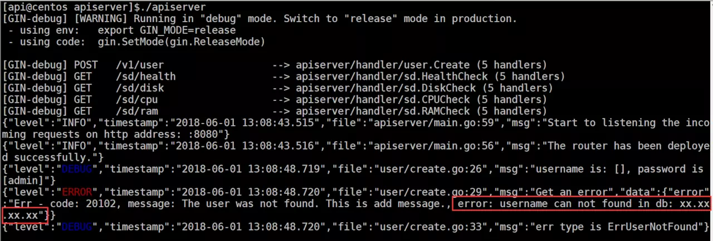

# 自定义业务错误信息
本小节源码下载路径：[demo05](https://github.com/lexkong/apiserver_demos/tree/master/demo05)

## 为什么要定制业务自己的错误码
在实际开发中引入错误码有如下好处：

- 可以非常方便地定位问题和定位代码行（看到错误码知道什么意思，`grep`错误码可以定位到错误码所在行）
- 如果 API 对外开放，有个错误码会更专业些
- 错误码包含一定的信息，通过错误码可以判断出错误级别、错误模块和具体错误信息
- 在实际业务开发中，一个条错误信息需要包含两部分内容：**直接展示给用户的`message`**和**用于开发人员`debug`的`error`**。`message`
可能会直接展示给用户，`error`是用于`debug`的错误信息，可能包含敏感/内部信息，不宜对外展示
- 业务开发过程中，可能需要判断错误是哪种类型以便做相应的逻辑处理，通过定制的错误码很容易做到这点，例如：
```go
    if err == errno.ErrBind {
        ...
    }
```
- Go 中的 HTTP 服务器开发都是引用`net/http`包，该包中只有 60 个错误码，基本都是跟 HTTP 请求相关的。在大型系统中，这些错误码完全不够用，
而且跟业务没有任何关联，满足不了业务需求。

## 在 apiserver 中引入错误码
我们通过一个新包`errno`来做错误码的定制，详见[demo05/pkg/errno](https://github.com/lexkong/apiserver_demos/tree/master/demo05/pkg/errno)。
```bash
$ ls pkg/errno/
code.go  errno.go
```

`errno`包由两个 Go 文件组成：`code.go`和`errno.go`。`code.go`用来统一存自定义的错误码，`code.go`的代码为：
```go
package errno

var (
	// Common errors
	OK                  = &Errno{Code: 0, Message: "OK"}
	InternalServerError = &Errno{Code: 10001, Message: "Internal server error"}
	ErrBind             = &Errno{Code: 10002, Message: "Error occurred while binding the request body to the struct."}

	// user errors
	ErrUserNotFound      = &Errno{Code: 20102, Message: "The user was not found."}
)
```

### 代码解析
在实际开发中，一个错误类型通常包含两部分：`Code`部分，用来唯一标识一个错误；`Message`部分，用来展示错误信息，这部分错误信息通常供前端直接展示。
这两部分映射在`errno`包中即为`&Errno{Code: 0, Message: "OK"}`。

### 错误码设计
目前错误码没有一个统一的设计标准，参考新浪开放平台 Error code 的设计，如下是设计说明：

错误返回值格式：
```js
{
  "code": 10002,
  "message": "Error occurred while binding the request body to the struct."
}
```

错误代码说明：
`10002`中的第一个`1`代表服务级错误，接下来的`00`代表服务模块代码，最后的`02`代表具体错误代码。

- 服务级别错误：1 为系统级错误；2 为普通错误，通常是由用户非法操作引起的
- 服务模块为两位数：一个大型系统的服务模块通常不超过两位数，如果超过，说明这个系统该拆分了
- 错误码为两位数：防止一个模块定制过多的错误码，后期不好维护
- `code = 0`说明是正确返回，`code > 0`说明是错误返回
- 错误通常包括系统级错误码和服务级错误码
- 建议代码中按服务模块将错误分类
- 错误码均为`>= 0`的数
- 在 apiserver 中 HTTP Code 固定为`http.StatusOK`，错误码通过`code`来表示。

## 错误信息处理
通过`errno.go`来对自定义的错误进行处理，`errno.go`的代码为：
```go
package errno

import "fmt"

type Errno struct {
	Code    int
	Message string
}

func (err Errno) Error() string {
	return err.Message
}

// Err represents an error
type Err struct {
	Code    int
	Message string
	Err     error
}

func New(errno *Errno, err error) *Err {
	return &Err{Code: errno.Code, Message: errno.Message, Err: err}
}

func (err *Err) Add(message string) error {
	err.Message += " " + message
	return err
}

func (err *Err) Addf(format string, args ...interface{}) error {
	err.Message += " " + fmt.Sprintf(format, args...)
	return err
}

func (err *Err) Error() string {
	return fmt.Sprintf("Err - code: %d, message: %s, error: %s", err.Code, err.Message, err.Err)
}

func IsErrUserNotFound(err error) bool {
	code, _ := DecodeErr(err)
	return code == ErrUserNotFound.Code
}

func DecodeErr(err error) (int, string) {
	if err == nil {
		return OK.Code, OK.Message
	}

	switch typed := err.(type) {
	case *Err:
		return typed.Code, typed.Message
	case *Errno:
		return typed.Code, typed.Message
	default:
	}

	return InternalServerError.Code, err.Error()
}
```

### 代码解析

`errno.go`源码文件中有两个核心函数`New()`和`DecodeErr()`，一个用来新建定制的错误，一个用来解析定制的错误，稍后会介绍如何使用。

`errno.go`同时也提供了`Add()`和`Addf()`函数，如果想对外展示更多的信息可以调用此函数，使用方法下面有介绍。

## 错误码实战
上面介绍了错误码的一些知识，这一部分讲开发中是如何使用`errno`包来处理错误信息的。为了演示，我们新增一个创建用户的 API：

1. `router/router.go`中添加路由，详见[demo05/router/router.go](https://github.com/lexkong/apiserver_demos/blob/master/demo05/router/router.go)：
```go
// Load loads the middlewares, routes, handlers.
func Load(g *gin.Engine, mw ...gin.HandlerFunc) *gin.Engine {
	// Middlewares.
	g.Use(gin.Recovery())
	g.Use(middleware.NoCache)
	g.Use(middleware.Options)
	g.Use(middleware.Secure)
	g.Use(mw...)
	// 404 Handler.
	g.NoRoute(func(c *gin.Context) {
		c.String(http.StatusNotFound, "The incorrect API route.")
	})

    // 添加的路由
	u := g.Group("/v1/user")
	{
		u.POST("", user.Create)
	}

	// The health check handlers
	svcd := g.Group("/sd")
	{
		svcd.GET("/health", sd.HealthCheck)
		svcd.GET("/disk", sd.DiskCheck)
		svcd.GET("/cpu", sd.CPUCheck)
		svcd.GET("/ram", sd.RAMCheck)
	}

	return g
}
```

2. `handler`目录下增加业务处理函数`handler/user/create.go`，
详见[demo05/handler/user/create.go](https://github.com/lexkong/apiserver_demos/blob/master/demo05/handler/user/create.go)。

## 测试验证
编译后启动 apiserver：
```bash
$ curl -XPOST -H "Content-Type: application/json" http://127.0.0.1:8080/v1/user

{
  "code": 10002,
  "message": "Error occurred while binding the request body to the struct."
}
```
因为没有传入任何参数，所以返回`errno.ErrBind`错误。
```bash
$ curl -XPOST -H "Content-Type: application/json" http://127.0.0.1:8080/v1/user -d'{"username":"admin"}'

{
  "code": 10001,
  "message": "password is empty"
}
```
因为没有传入`password`，所以返回`fmt.Errorf("password is empty")`错误，该错误信息不是定制的错误类型，`errno.DecodeErr(err)`解析时会解析为
默认的`errno.InternalServerError`错误，所以返回结果中`code`为`10001`，`message`为`err.Error()`。
```bash
$ curl -XPOST -H "Content-Type: application/json" http://127.0.0.1:8080/v1/user -d'{"password":"admin"}'

{
  "code": 20102,
  "message": "The user was not found. This is add message."
}
```
因为没有传入`username`，所以返回`errno.ErrUserNotFound`错误信息，并通过`Add()`函数在`message`信息后追加了`This is add message.`信息。

通过：
```go
   if errno.IsErrUserNotFound(err) {
        log.Debug("err type is ErrUserNotFound")
    }
```
演示了如何通过定制错误方便地对比是不是某个错误，在该请求中，apiserver 会输出如下错误：


可以看到在后台日志中会输出敏感信息`username can not found in db: xx.xx.xx.xx`，但是返回给用户
的`message （{"code":20102,"message":"The user was not found. This is add message."}`不包含这些敏感信息，可以供前端直接对外展示。
