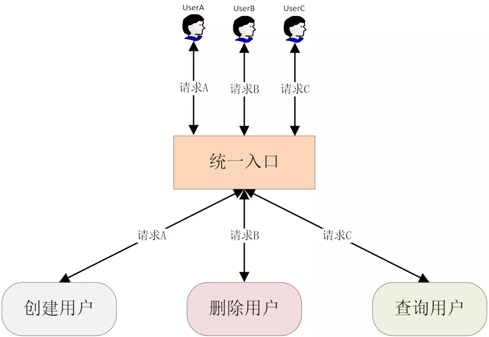
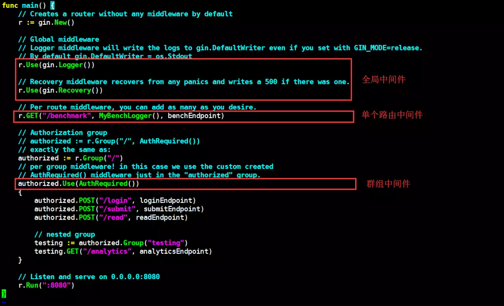

# HTTP 调用添加自定义处理逻辑
本小节源码下载路径：[demo08](https://github.com/lexkong/apiserver_demos/blob/master/demo08)

## 需求背景
在实际开发中，我们可能需要对每个请求/返回做一些特定的操作，比如记录请求的 log 信息，在返回中插入一个 Header，对部分接口进行鉴权，这些都需要一个统一的入口，逻辑如下：


这个功能可以通过引入`middleware`中间件来解决。Go 的`net/http`设计的一大特点是特别容易构建中间件。apiserver 所使用的 gin 框架也提供了类似的中间件。

## gin middleware 中间件
在 gin 中，可以通过如下方法使用`middleware`：
```go
g := gin.New()
g.Use(middleware.AuthMiddleware())
```

其中`middleware.AuthMiddleware()`是`func(*gin.Context)`类型的函数。中间件只对注册过的路由函数起作用。

在 gin 中可以设置 3 种类型的`middleware`：

- 全局中间件
- 单个路由中间件
- 群组中间件
这里通过一个例子来说明这 3 种中间件。



- 全局中间件：注册中间件的过程之前设置的路由，将不会受注册的中间件所影响。只有注册了中间件之后代码的路由函数规则，才会被中间件装饰。
- 单个路由中间件：需要在注册路由时注册中间件
```go
r.GET("/benchmark", MyBenchLogger(), benchEndpoint)
```

- 群组中间件：只要在群组路由上注册中间件函数即可。

## 中间件实践
为了演示中间件的功能，这里给 apiserver 新增两个功能：

1. 在请求和返回的 Header 中插入`X-Request-Id`（`X-Request-Id`值为 32 位的 UUID，用于唯一标识一次 HTTP 请求）
2. 日志记录每一个收到的请求

### 插入`X-Request-Id`
首先需要实现`middleware.RequestId()`中间件，在`router/middleware`目录下新建一个 Go 源文件`requestid.go`，
内容为（详见 [demo08/router/middleware/requestid.go](https://github.com/lexkong/apiserver_demos/blob/master/demo08/router/middleware/requestid.go)）：
```go
package middleware

import (
	"github.com/gin-gonic/gin"
	"github.com/satori/go.uuid"
)

func RequestId() gin.HandlerFunc {
	return func(c *gin.Context) {
		// Check for incoming header, use it if exists
		requestId := c.Request.Header.Get("X-Request-Id")

		// Create request id with UUID4
		if requestId == "" {
			u4, _ := uuid.NewV4()
			requestId = u4.String()
		}

		// Expose it for use in the application
		c.Set("X-Request-Id", requestId)

		// Set X-Request-Id header
		c.Writer.Header().Set("X-Request-Id", requestId)
		c.Next()
	}
}
```

该中间件调用`github.com/satori/go.uuid`包生成一个 32 位的 UUID，并通过`c.Writer.Header().Set("X-Request-Id", requestId)`设置在返回包的 Header 中。

该中间件是个全局中间件，需要在`main`函数中通过`g.Use()`函数加载：
```go
func main() {
    ...
    // Routes.
    router.Load(
        // Cores.
        g,

        // Middlwares.
        middleware.RequestId(),
    )
    ...
}...
```

`middleware.Logging()`实现稍微复杂点，
可以直接参考源码实现：[demo08/router/middleware/logging.go](https://github.com/lexkong/apiserver_demos/blob/master/demo08/router/middleware/logging.go)。

这里有几点需要说明：

1. 该中间件需要截获 HTTP 的请求信息，然后打印请求信息，因为 HTTP 的请求`Body`，在读取过后会被置空，所以这里读取完后会重新赋值：
```go
var bodyBytes []byte
if c.Request.Body != nil {
    bodyBytes, _ = ioutil.ReadAll(c.Request.Body)
}

// Restore the io.ReadCloser to its original state
c.Request.Body = ioutil.NopCloser(bytes.NewBuffer(bodyBytes))
```
2. 截获 HTTP 的 Response 更麻烦些，原理是重定向 HTTP 的 Response 到指定的 IO 流，详见源码文件。
3. 截获 HTTP 的 Request 和 Response 后，就可以获取需要的信息，最终程序通过`log.Infof()`记录 HTTP 的请求信息。
4. 该中间件只记录业务请求，比如`/v1/user`和`/login`路径。